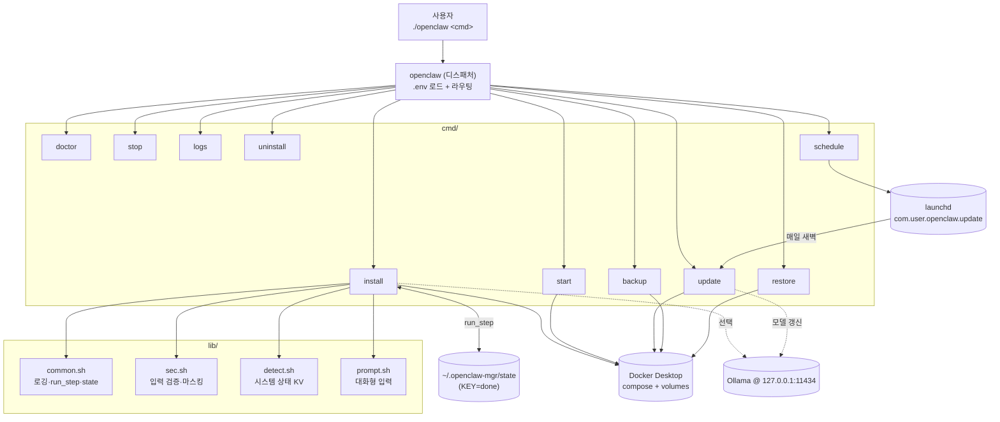
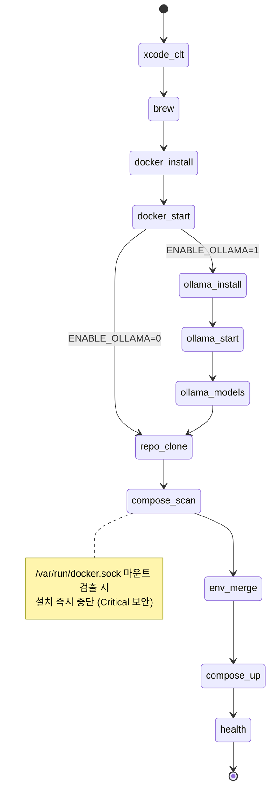
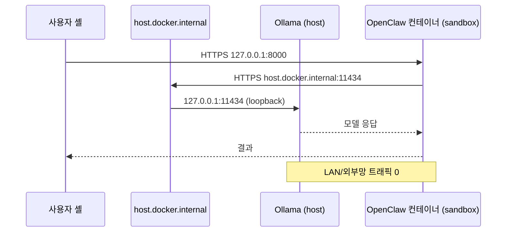

# Architecture / 아키텍처

> 🇰🇷 이 문서는 모듈 구조·상태 머신·백업 포맷·보안 위협 모델을 다룹니다.
> 🇺🇸 This document covers module structure, state machine, backup format, and security threat model.
> Diagrams are language-agnostic; section headers below are in Korean for brevity. Open an issue if a full English translation is needed.

## 📖 목차 / Contents

- [모듈 구조 / Module structure](#모듈-구조--module-structure)
- [install 상태 머신](#install-상태-머신)
- [백업 포맷](#백업-포맷)
- [보안 컨테이너 옵션 (compose.security.yml)](#보안-컨테이너-옵션-composesecurityyml)
- [데이터 흐름](#데이터-흐름)

---

## 모듈 구조 / Module structure



## install 상태 머신



각 상태는 `~/.openclaw-mgr/state` 에 `KEY=done` 으로 기록되어 다음 실행 시 자동 스킵.

## 백업 포맷

`openclaw-YYYYmmdd-HHMMSS-<NAME>.tar.gz` 안:

```
META                       # created, host, openclaw_dir, git_commit, mgr_version
volumes/
  <project>_<volname>.tgz  # docker volume 별 tar
env.gpg   또는   env.plain # .env (GPG AES256 또는 평문)
```

같은 이름의 `<archive>.sha256` 파일이 함께 생성됩니다. `restore.sh` 는 다음 순서로 검증:

1. `shasum -a 256 -c` 무결성
2. `tar tzf` 로 절대경로/`..` 미리 검사 → 발견 시 거부
3. `--no-same-owner --no-same-permissions` 로 임시 디렉터리 추출
4. 사용자 확인 후 볼륨 재생성·`.env` 복구

## 보안 컨테이너 옵션 (compose.security.yml)

| 옵션 | 효과 |
|---|---|
| `read_only: true` + `tmpfs` | 루트 파일시스템 변조 차단 |
| `cap_drop: [ALL]` | Linux capabilities 제거 (CAP_SYS_ADMIN 등) |
| `security_opt: [no-new-privileges:true]` | setuid 권한 상승 차단 |
| `pids_limit`, `mem_limit`, `cpus` | fork bomb / OOM / CPU 폭주 방어 |
| 항상 `127.0.0.1` 바인딩 (base compose 수정) | LAN 노출 차단 |

## 데이터 흐름



---

<!-- RELATED-DOCS:BEGIN -->
## 🔗 관련 문서 / Related docs

| 문서 | 무엇이 있나 |
|---|---|
| [🌱 처음부터 / From zero](GUIDE-FROM-ZERO.md) | 터미널·클릭·파일 개념부터 차근차근 (KO+EN) |
| [🚀 빠른 시작 (KO)](QUICKSTART-ko.md) | 터미널 열기 → 5개 명령 → 한 줄 설치 |
| [🚀 Quickstart (EN)](QUICKSTART-en.md) | Open terminal → 5 commands → one-liner install |
| [🪜 완전 수동 설치](GUIDE-MANUAL-INSTALL.md) | brew/스크립트 없이 직접 다운 (KO+EN, 프로덕션 부록) |
| [🐳 Docker 기초](GUIDE-DOCKER.md) | 컨테이너·이미지·compose 3분 가이드 |
| [🧠 Ollama 기초](GUIDE-OLLAMA.md) | 로컬 LLM 데몬 사용법 |
| [🐾 OpenClaw 기초](GUIDE-OPENCLAW.md) | 에이전트 구조·웹에서 가져오기 단락 |
| [🌐 웹 정보 가져오기 / surf](GUIDE-WEB-FETCH.md) | 코스피·뉴스·환율·논문 — `surf` 샌드박스 명령 포함 |
| [🎨 크리에이티브 파이프라인](GUIDE-CREATIVE-PIPELINE.md) | Pinterest → 나노바나나(4창) → Figma 자동 배치 |
| [🎬 쇼츠 자동화](GUIDE-SHORTS-PIPELINE.md) | Pinterest → 미리캔버스 → CapCut → 9:16 MP4 |
| [🚑 트러블슈팅](TROUBLESHOOTING.md) | 흔한 오류와 해결 명령 |
| [🤝 기여 가이드 (입문)](GUIDE-CONTRIBUTING.md) | 오타·번역·베타테스트도 환영 |
| [🐙 기여 가이드 (코드)](CONTRIBUTING.md) | 코드 스타일·PR 절차 |
| [📦 릴리스 노트 v0.1.0](RELEASE_NOTES_v0.1.0.md) | 변경 사항 |

⬆️ [README (KO)](../README.md) · [README (EN)](../README.en.md)
<!-- RELATED-DOCS:END -->
