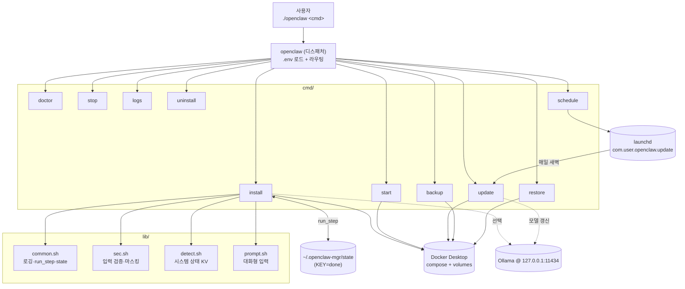
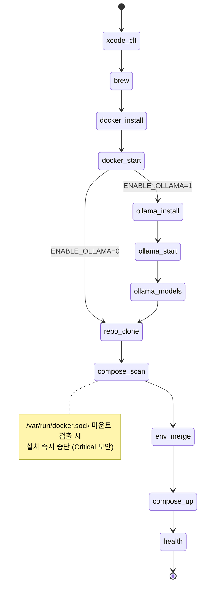
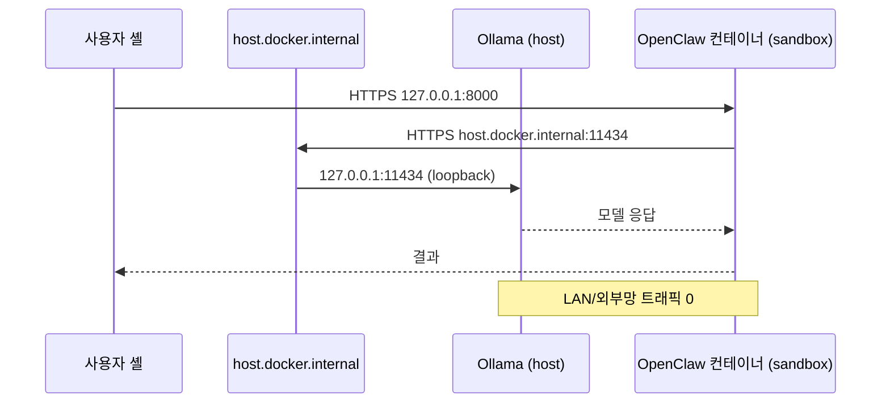

# Architecture / 아키텍처

> 🇰🇷 이 문서는 모듈 구조·상태 머신·백업 포맷·보안 위협 모델을 다룹니다.
> 🇺🇸 This document covers module structure, state machine, backup format, and security threat model.
> Diagrams are language-agnostic; section headers below are in Korean for brevity. Open an issue if a full English translation is needed.

## 모듈 구조 / Module structure



## install 상태 머신



각 상태는 `~/.openclaw-mgr/state` 에 `KEY=done` 으로 기록되어 다음 실행 시 자동 스킵.

## 백업 포맷

`openclaw-YYYYmmdd-HHMMSS-<NAME>.tar.gz` 안:

```
META                       # created, host, openclaw_dir, git_commit, mgr_version
volumes/
  <project>_<volname>.tgz  # docker volume 별 tar
env.gpg   또는   env.plain # .env (GPG AES256 또는 평문)
```

같은 이름의 `<archive>.sha256` 파일이 함께 생성됩니다. `restore.sh` 는 다음 순서로 검증:

1. `shasum -a 256 -c` 무결성
2. `tar tzf` 로 절대경로/`..` 미리 검사 → 발견 시 거부
3. `--no-same-owner --no-same-permissions` 로 임시 디렉터리 추출
4. 사용자 확인 후 볼륨 재생성·`.env` 복구

## 보안 컨테이너 옵션 (compose.security.yml)

| 옵션 | 효과 |
|---|---|
| `read_only: true` + `tmpfs` | 루트 파일시스템 변조 차단 |
| `cap_drop: [ALL]` | Linux capabilities 제거 (CAP_SYS_ADMIN 등) |
| `security_opt: [no-new-privileges:true]` | setuid 권한 상승 차단 |
| `pids_limit`, `mem_limit`, `cpus` | fork bomb / OOM / CPU 폭주 방어 |
| 항상 `127.0.0.1` 바인딩 (base compose 수정) | LAN 노출 차단 |

## 데이터 흐름


